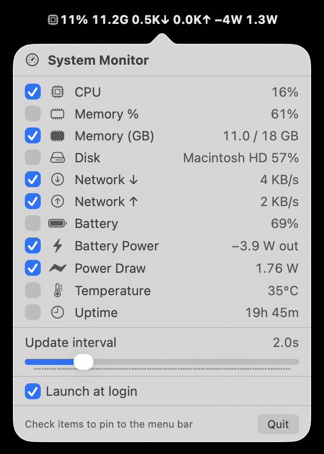

# mac-system-monitor

A lightweight, dependency-free macOS **menu-bar system monitor**. Pin a compact,
configurable readout — CPU, RAM, disk, network, battery, power draw, temperature
— to your menu bar; click for the full list with checkboxes.

<p align="center"></p>

> **Public domain** ([Unlicense](LICENSE)) — use it, fork it, ship it, no
> attribution needed. Apple Silicon · macOS 13+ · built with `swiftc`, no Xcode
> project and no dependencies. Not affiliated with Apple.

## Quick start

```sh
git clone https://github.com/<you>/mac-system-monitor.git
cd mac-system-monitor
./install.sh      # build → ~/Applications → launch + start at login
```

Or just `./build.sh` and `open SysMonitor.app` to try it without installing.

## Features

- Live menu-bar readout at a configurable interval (default 2 s, down to 0.1 s).
  Compact, bold values; CPU / RAM % / Disk / Battery lead with an SF Symbol,
  the rest carry their own unit (`10.3G`, `14.7K↓`, `1.6W`, `31°C`).
- Click to open a popover listing **all** sources with their current values
  (hover any row for a tooltip).
- Checkbox per source toggles whether it appears in the bar; choices persist
  across launches.
- **Launch-at-login** toggle in the popover.
- **Rolling CSV log** of all values to `~/Documents/SysMonitor.csv` (capped ~1 MB).
- Runs as a menu-bar-only accessory (no Dock icon).
- Minimal footprint: ~0% CPU / ~13 MB when idle. It reads only the metrics
  you've pinned while the popover is closed, throttles slow-changing sources,
  and pauses entirely while the display sleeps. See
  [DESIGN.md §3.9](DESIGN.md#39-efficiency-do-the-least-work-that-preserves-functionality).

The full design rationale is in [DESIGN.md](DESIGN.md); the feature-by-feature
history is in [CHANGELOG.md](CHANGELOG.md).

### Metrics

| Metric | Source | Notes |
|---|---|---|
| CPU % | `host_statistics(HOST_CPU_LOAD_INFO)` | Busy/total tick deltas between samples |
| Memory % | `host_statistics64(HOST_VM_INFO64)` | "In use" = app + wired + compressed (matches Activity Monitor) |
| Memory (GB) | same source | In use / total, GiB |
| Disk % | `URLResourceValues` | Each mounted **local** volume (boot volume drives the bar) |
| Network ↓ / ↑ | `getifaddrs` | Physical interfaces only (VPN/virtual excluded); base-2 K/M per second |
| Battery % | `IOKit.ps` power sources | Hidden on machines without a battery |
| Battery Power | `AppleSmartBattery` Voltage × Amperage | Signed: `+W` charging, `−W` discharging. SMC-limited (~30–60 s refresh) |
| Power Draw | IOReport `Energy Model` counters (via `dlsym`) | Real-time package power (CPU+GPU+ANE+DRAM+display+…); updates every poll |
| Temperature | Private IOHID thermal sensors (via `dlsym`) | Hottest SoC die (`tdie`); degrades gracefully |
| Uptime | `ProcessInfo.systemUptime` | |

The **update interval** (0.1 s–10 s) is adjustable from a slider in the popover
and persists across launches.

Sources that aren't available on a given machine are filtered out of the
popover automatically.

## Requirements

- Apple Silicon Mac, macOS 13+.
- **Command Line Tools** for Xcode (`xcode-select --install`). A full Xcode
  install is **not** required.

## Build

```sh
./build.sh
```

Compiles the sources with `swiftc`, assembles `SysMonitor.app` in the project
directory, writes its `Info.plist` (with `LSUIElement` so there's no Dock
icon), and ad-hoc code-signs it.

Run the result directly:

```sh
open SysMonitor.app
# or, to see console output:
./SysMonitor.app/Contents/MacOS/SysMonitor
```

> **Why `swiftc` and not Swift Package Manager?** The PackageDescription
> library bundled with the current Command Line Tools has a version skew that
> breaks `swift build` (link error in the manifest). Compiling the sources
> directly sidesteps SwiftPM entirely. See
> [DESIGN.md §3.6](DESIGN.md#36-build-system-swiftc-directly).

## Deploy + launch at login

```sh
./install.sh
```

This builds, then:

1. Stops any running/registered instance.
2. Copies the app to `~/Applications/SysMonitor.app` (a stable location).
3. Writes a LaunchAgent to `~/Library/LaunchAgents/com.local.sysmonitor.plist`.
4. Loads it with `launchctl bootstrap` — starting it now and at every login.

The LaunchAgent uses `RunAtLoad=true` and `KeepAlive=false`, so it starts at
login but the **Quit** button in the popover stays quit until the next login.

### Update an installed copy

Edit code, then re-run `./install.sh`. It stops the old instance, replaces the
bundle, and reloads.

### Uninstall

```sh
launchctl bootout gui/$(id -u)/com.local.sysmonitor
rm ~/Library/LaunchAgents/com.local.sysmonitor.plist
rm -rf ~/Applications/SysMonitor.app
```

## Tests

```sh
./test.sh            # 30-second value-range test + smoke
./test.sh 5          # shorter value window
```

Compiles the reader sources into a standalone binary (no XCTest/SwiftPM) and
checks: constructors don't crash, every reading stays in a plausible range over
the window (CPU 0–100, memory 0–100, power 0–200 W, temp 0–150 °C, …), then
launches the real app and confirms it survives.

## Project layout

```
mac-app/
├── build.sh                     # compile + assemble .app
├── install.sh                   # build + deploy + register at login
├── test.sh                      # smoke + value-range tests
├── README.md
├── DESIGN.md                    # architecture & decision rationale
├── CHANGELOG.md                 # feature-by-feature iteration history
├── Tests/main.swift             # test runner (reader ranges + manager construct)
└── Sources/SysMonitor/
    ├── main.swift               # app bootstrap; status item (attributed-title bar), popover, sleep/wake
    ├── Metrics.swift            # metric model + manager (background-queue refresh loop, bar composition)
    ├── Readers.swift            # public-API readers: CPU, memory, disk, network, battery, uptime
    ├── Sensors.swift            # private-API readers via dlsym: IOHID temperature + IOReport power
    ├── Logger.swift             # rolling CSV log to ~/Documents
    ├── LoginItem.swift          # launch-at-login (LaunchAgent) helper
    └── MenuContentView.swift    # SwiftUI popover content (rows, tooltips, interval slider, login toggle)
```

## Troubleshooting

- **Nothing in the menu bar:** confirm the process is up with
  `pgrep -xl SysMonitor`, and check the launchd job with
  `launchctl print gui/$(id -u)/com.local.sysmonitor`.
- **Temperature shows "unavailable":** the private IOHID symbols or sensor
  services weren't found. Everything else still works; see
  [DESIGN.md §3.5](DESIGN.md#35-temperature-the-private-api-problem).
- **Battery / power rows missing:** expected on desktops (no `AppleSmartBattery`).

## A note on private APIs

Temperature and Power Draw read **private Apple frameworks** (IOHID thermal
sensors and IOReport energy counters), resolved at runtime with `dlsym`. There
is no public API for this data on Apple Silicon. The readers fail gracefully —
if a symbol is missing those two rows simply disappear and everything else keeps
working — but they can break on a future macOS update or differ by chip. Every
other metric uses public mach/BSD/IOKit APIs. See
[DESIGN.md](DESIGN.md) §3.5 and §3.8.

## Contributing & forking

This is a public-domain tool — fork it, hack on it, ship your own version. No
CLA, no attribution required. Adding a metric is one enum case plus a reader;
see [CONTRIBUTING.md](CONTRIBUTING.md) and [DESIGN.md](DESIGN.md) §5.

## License

Released into the public domain under [The Unlicense](LICENSE). Do whatever you
want with it.
